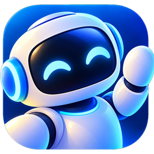
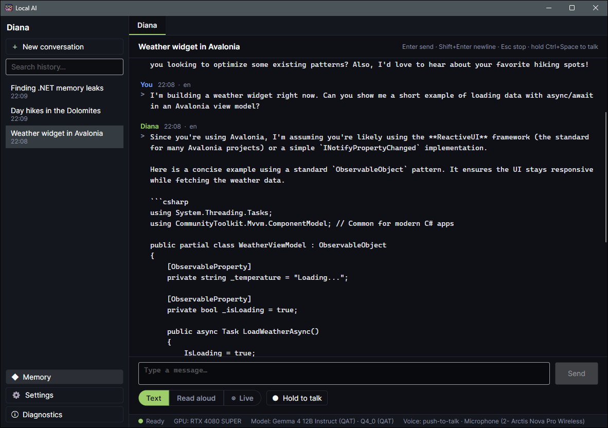
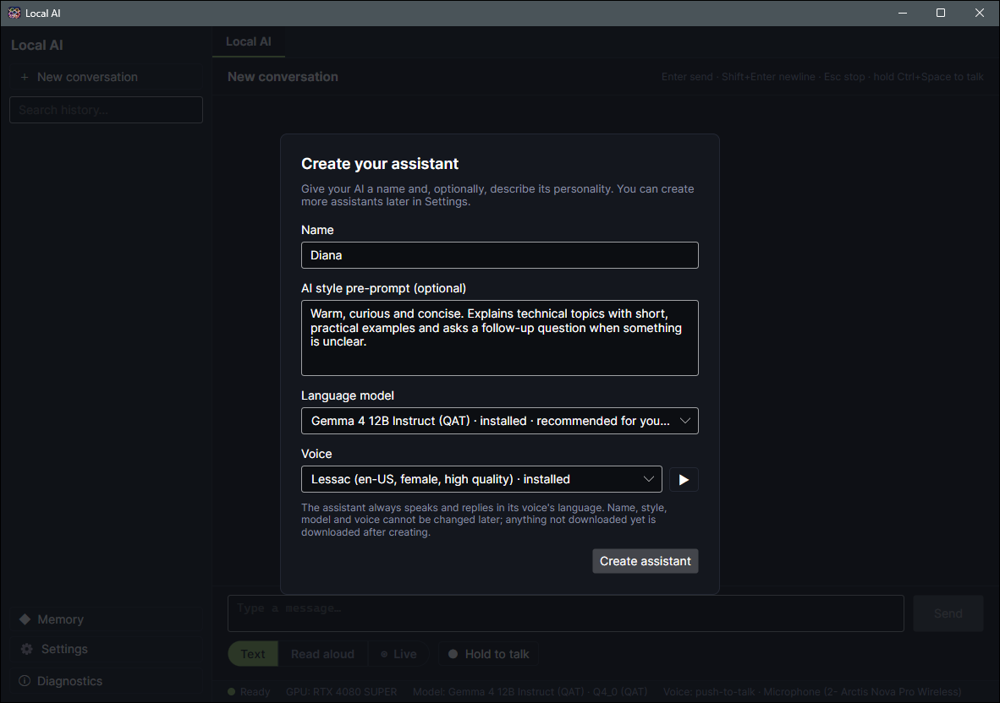
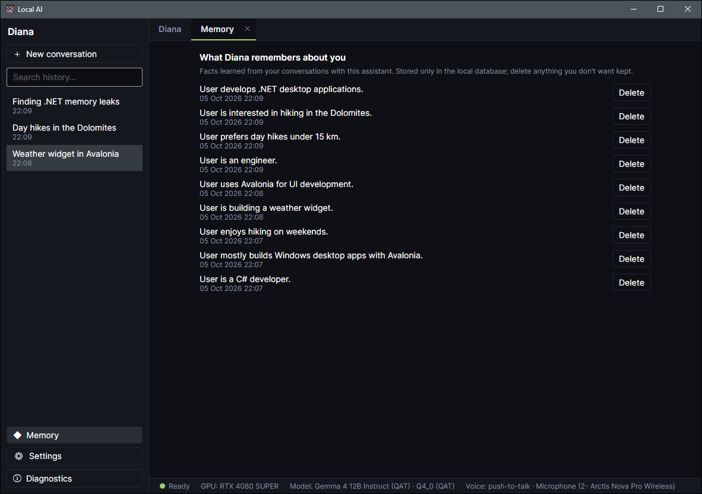
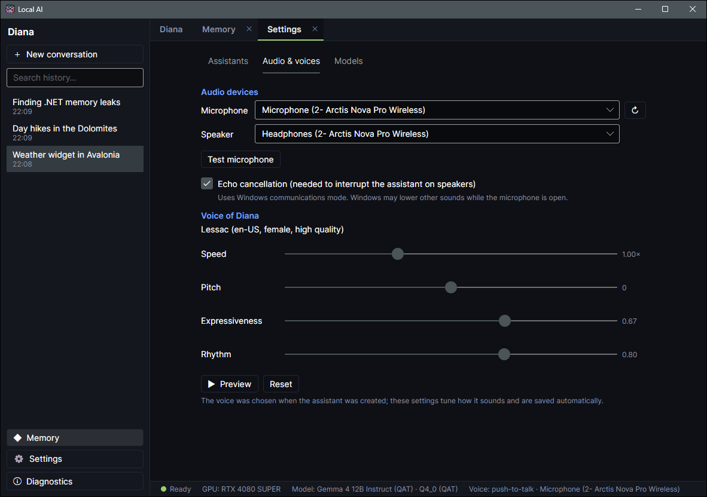
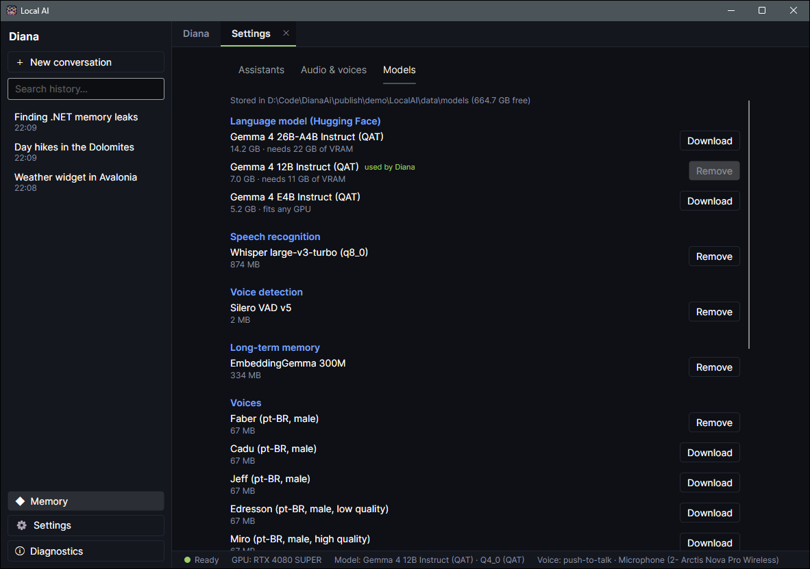

<h1 align="center">Local AI</h1>

<p align="center">
  
</p>

<p align="center">
  <b>Personal AI assistants that run entirely on your Windows PC.</b><br>
  Chat or talk out loud. Conversations, voice and memories never leave your computer.
</p>

<p align="center">
  
  
  
  
</p>

<p align="center">
  
</p>

- **Your own assistants:** each with a name, personality, language model, voice, conversations and memories.
- **Text or voice:** streaming chat, push-to-talk, read aloud, or hands-free Live mode that you can interrupt.
- **Always at hand:** it runs in the notification area. Give each assistant a global shortcut to start and stop a
  voice conversation from any application; the tray icon blinks while it listens.
- **Long-term memory:** it learns facts about you and recalls them when relevant. You can see and delete each one.
- **Fully offline:** llama.cpp (Gemma 4), Whisper, Piper and SQLite on your GPU. The Internet is used only to download
  models.
- **Portable:** everything stays in the app folder. Copy it to install, delete it to remove every trace.

<table>
  <tr>
    <td width="50%"></td>
    <td width="50%"></td>
  </tr>
  <tr>
    <td align="center">Create an assistant</td>
    <td align="center">What it remembers about you</td>
  </tr>
  <tr>
    <td></td>
    <td></td>
  </tr>
  <tr>
    <td align="center">Voice and audio settings</td>
    <td align="center">Models managed in the app</td>
  </tr>
</table>

## Getting started

**Download:** get `LocalAI-win-x64.zip` from the [latest release](https://github.com/lluancarlo/LocalAI/releases/tag/latest)
(built from `master` on every push), unzip it anywhere writable and run `LocalAI\LocalAI.exe`.

**Build it yourself:** you need Windows 11, the [.NET 10 SDK](https://dotnet.microsoft.com/download), an NVIDIA GPU
(recommended) and about 9 GB of disk space for models.

```powershell
git clone https://github.com/lluancarlo/LocalAI.git
cd LocalAI
powershell -ExecutionPolicy Bypass -File scripts\publish.ps1
publish\LocalAI\LocalAI.exe
```

`publish.ps1` also writes `publish\LocalAI.zip`, the same files without `data\`.

On first launch you create your first assistant and the app downloads the models it needs.

Closing the window keeps Local AI running in the notification area; use **Exit** in the tray icon's menu to quit.
Set an assistant's shortcut in **Settings › Assistants**.

## Privacy

- **Offline:** conversations, voice and memories never leave your PC. The Internet is used only to download models.
- **One folder:** everything the app creates (database, settings, logs, temporary files, models) is in `data\` next
  to `LocalAI.exe`. Delete the folder to remove it all.
- **Per assistant:** each assistant has its own conversations and memories. Deleting an assistant deletes them too.
- **Logs** record what the app did, never what you said or typed.
- **Outside the folder, Windows keeps its own records** of any program you run. These contain only the path of
  `LocalAI.exe` and timestamps:
  - the tray icon setting (`HKCU\Control Panel\NotifyIconSettings`);
  - microphone access history (*Settings › Privacy › Microphone*);
  - program launch data (`C:\Windows\Prefetch`).

## License

No license: all rights reserved. The source code is public to read, but you may not modify, copy or distribute it.
Bundled third-party components keep their own licenses: see [THIRD-PARTY-NOTICES.md](THIRD-PARTY-NOTICES.md).
